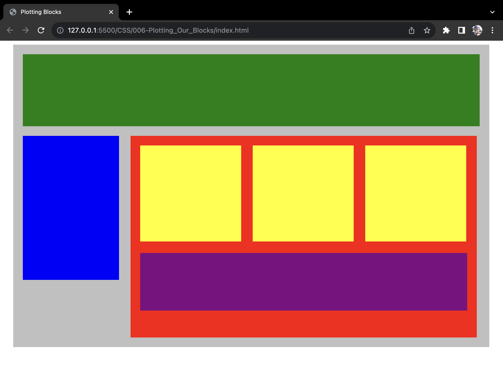

# Plotting Our Blocks

Objective of **Project #006: Ploting Our Blocks** is to learn how to use **display properties** with `inline-block`, `padding`, and `margin` to place each block in its proper place as seen below:

Redone: ２０２３年０８月３０日（水）