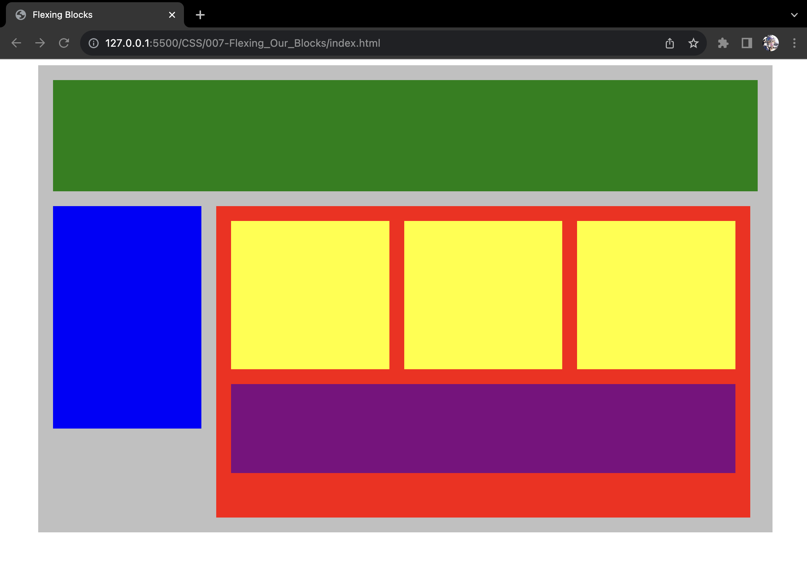

# Flexing Our Blocks

Objective of **Project #007: Flexing Our Blocks**, similarly to [Plotting Our Blocks](/CSS/006-Plotting_Our_Blocks), is to learn how to use **display properties** but instead with `display: flex` to place each block in its proper place as seen below:

Redone: ２０２３年０８月３０日（水）