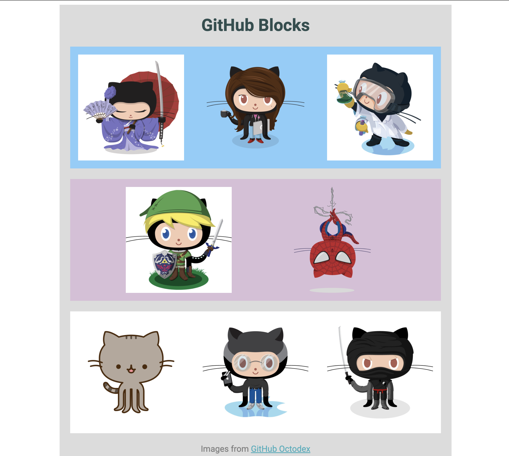

# GitHub Blocks

The objectives of **Project #008: GitHub Blocks** is to practice using **Box Model** properties (i.e., `padding`, `border`, `margin`, etc.), `Flexbox`, and different values of `justify-content`.
Images used in this project are from The [Octodex](https://octodex.github.com).

Redone: ２０２３年０８月３０日（水）