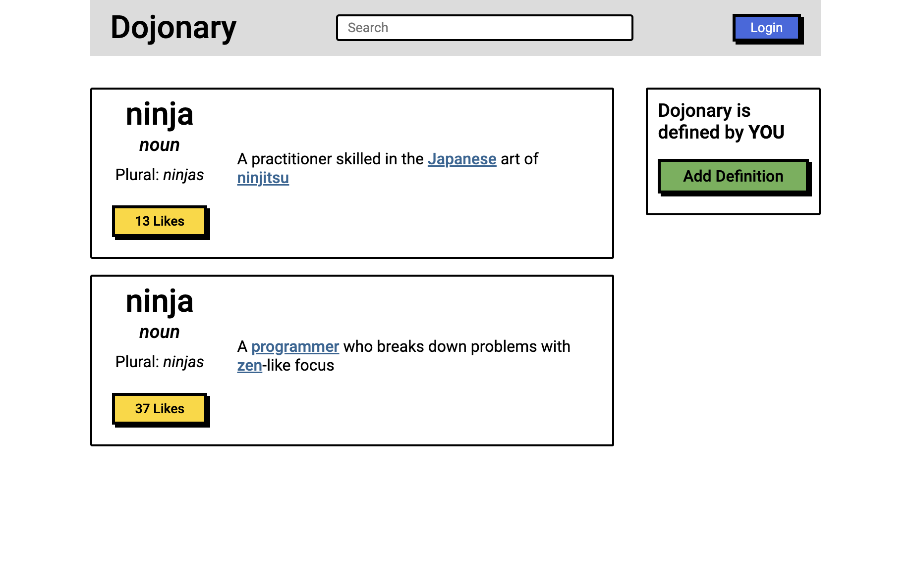
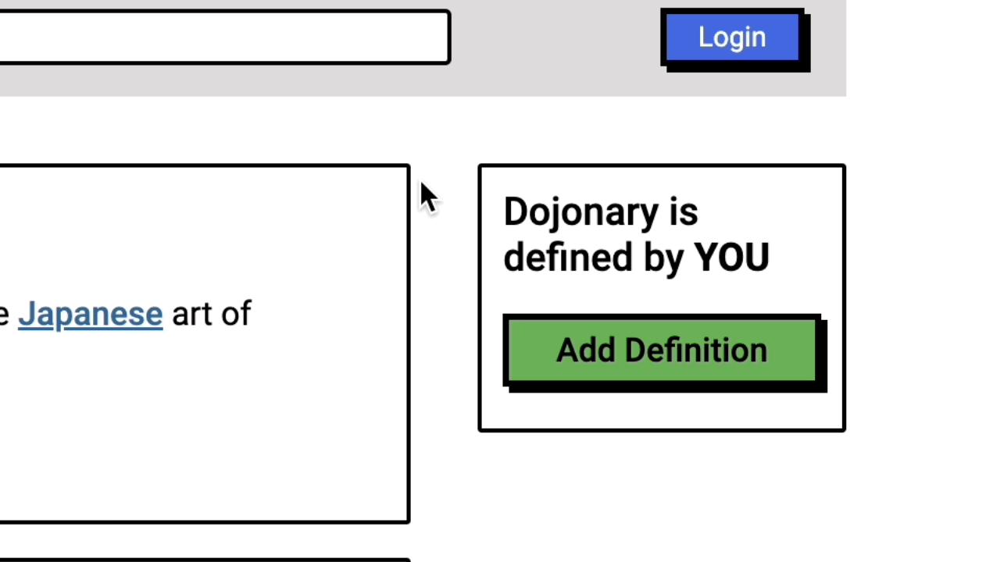

# Button Clicker

Objective of **Project #013: Button Clicker** is to add JavaScript functionality to this webpage:

---

## Login Functionality

The `login()` function toggles the "Login" and "Logout" keywords.

---

## Message Alert

The `message()` function alerts the user that the definition has been liked.

---

## Hide Button

The `hide()` function removes the "Add Definition" button upon interaction.

---

Redone: ２０２３年０9月０２日（土）
